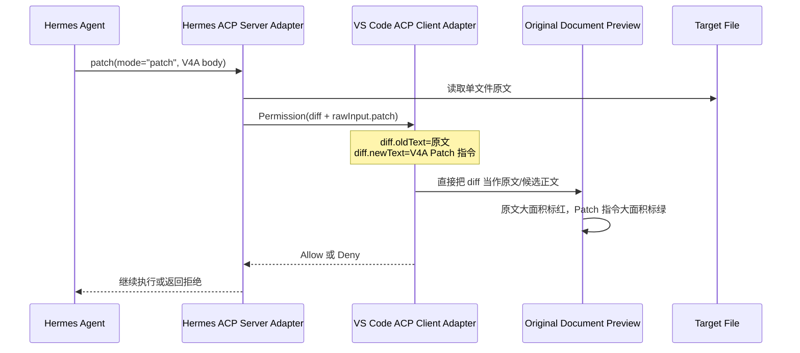
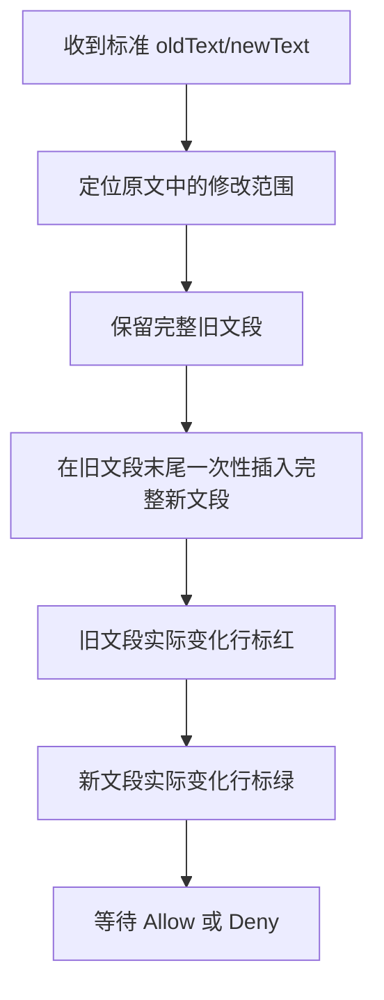

# 当前状态（As-Is）

- Status: confirmed
- Prerequisites: [02-acceptance-criteria.md](./02-acceptance-criteria.md)
- Evidence: Hermes Agent `0.18.2` revision `1705a440` 当前源码与未提交工作区；Hermes Agent VS Code `0.2.51` revision `05c3046`；ACP Schema；用户截图与确定性复现
- Confirmed decisions: D-01 至 D-10
- Confirmation evidence: 用户于 2026-08-17 回复“好”，确认进入 To-Be
- Confirmation date: 2026-08-17
- Blocking open questions: 无

## 系统与边界

本 Spec 的证据横跨两个本地代码库，但修改范围只在 VS Code 插件，并包含四个行为边界：

1. Hermes Core 负责模型工具调用和真实文件修改。
2. Hermes Python `acp_adapter` 在 ACP Session 内投影编辑审批数据并桥接 Permission；该层是问题来源证据，但不是本次修改对象。
3. Hermes Agent VS Code 的 ACP Client Adapter 接收并保留原始 Permission request，然后把请求交给审批和预览流程。
4. VS Code 原文档 Editor 根据 Diff 内容构造临时预览；Webview 独立维持审批与 Agent 回显。

Hermes Desktop、CLI、Gateway、其他 ACP 客户端和 Hermes Python 运行时均不需要修改，原因不是改变服务端投影，而是本次兼容转换只作用于该插件的原文档预览副本。

## 当前 V4A ACP 审批流

### 当前生产端行为

- `acp_adapter/edit_approval.py` 的 V4A proposal 会提取 Patch 中的文件路径。
- 单文件情况下读取目标文件全文作为 `old_text`。
- 同一 proposal 将原始 V4A Patch body 直接作为 `new_text`。
- `build_acp_edit_tool_call` 再把 proposal 转换为 ACP `type="diff"` 内容。
- ACP Schema 对 `newText` 的定义是修改后的新内容，因此当前 V4A proposal 与协议字段语义不一致。
- `patch mode="replace"` 会在审批前计算真实修改后全文；`write_file` 直接使用待写入正文。二者不存在相同的字段语义错误。

### 当前插件可取得的原始输入

- `session/request_permission` 的 `toolCall.content` 含 `type="diff"` block，其中有目标 `path`、原文件 `oldText` 和被错误放入 `newText` 的 V4A Patch。
- 同一 `toolCall.rawInput` 保留 `tool="patch"`、`arguments.mode="patch"` 和 `arguments.patch`，可以明确识别 V4A 工具调用并取得未丢失的 Patch body。
- 当前 ACP Client 把完整 request 交给 Permission handler；插件不需要修改 Hermes 服务端或发明新的跨进程字段即可完成预览兼容。

### ACP 服务端隔离事实

- ACP 编辑审批 requester 默认值为空。
- 只有 ACP Agent turn 会临时绑定 requester，并在 turn 结束时恢复。
- 通用工具入口只有在 requester 已绑定时才构造 ACP 编辑 proposal。
- 这些事实解释了为什么错误 payload 只出现在 ACP 路径，但不构成本次修改 Hermes 服务端的理由；本次选择在插件预览边界兼容它。

## 当前 VS Code 文档内 Diff 流

### 当前定位与分类

- `lib/diff-preview.js` 会在 `oldText` 等于原文件全文时，通过公共前缀和后缀把范围缩小到第一处变化至最后一处变化。
- `lib/document-review.js` 使用行级变化数和字符数区分本地 Diff 与完整 Review。
- 目标文档已经打开时，`extension.js` 优先进入文档内 inline Diff，不因变化量大而切换到 Review Editor。
- 真正的“原文全文/修改后全文”可以正确收缩；V4A Patch 指令作为 `newText` 时无法收缩，因两份内容不存在有效公共正文边界。

### 当前文档内呈现

- inline Diff 只执行一次临时插入：把完整 `newText` 插在旧范围结束位置。
- 旧文段继续位于原位置，新文段完整出现在旧文段下方。
- 行级算法能够识别实际变化行，所以旧块和新块中的未变化行保持普通样式。
- 但未变化上下文仍在旧块和新块各出现一次；中长段落会形成完整“旧块 + 新块”。
- 当前预览记录一个连续 `insertText`、插入偏移和前后锚点，用于 Deny 或退出时安全移除临时内容。

### 已完成的确定性可行性探针

- 使用当前真实 Permission payload 结构进行内存探针：从 `rawInput.arguments.patch` 解析单文件、多个 `@@` hunk 的中文 V4A Patch，并基于 Diff block 的原文生成完整候选正文。
- 将该候选正文交给现有 `prepareDocumentReview` 后，预览成功收缩为两处真实变化，输出中没有 `*** Begin Patch`、`*** Update File`、`@@` 或 `*** End Patch`。
- 紧密排列探针把同一变化 hunk 生成成“旧行 1、新行 1、旧行 2、新行 2”，证明目标次序可以由现有行级 Diff operations 推导。
- 首次使用原始偏移回滚多个插入段时，因前序插入造成偏移累积而失败；改为记录应用完成后的每个临时范围，并按位置逆序移除后，源文档逐字节恢复一致。
- 因此两个问题都有插件内的可执行路径；后续 To-Be 必须把“最终范围记录 + 逆序清理”定义为安全规则，不能沿用单一插入块或原始偏移的假设。

## 当前审批交互

- Permission request 由扩展按 session 和 request ID 排队、展示和解决。
- 原文档 Diff 只是审批请求的一个预览入口，不拥有 Allow、Deny 或反馈语义。
- Allow、Deny、预设选项、自由反馈、提醒、重新打开预览和 Pending 生命周期均由现有确认流程管理。
- 文档内预览关闭或重新打开不等于允许或拒绝，审批仍保持 Pending。

## 当前 Agent 回显

- Agent Thinking、Action、结果和最终回答通过 ACP session/update 与独立的前端消息状态渲染。
- 文档内 inline Diff 不创建新的 Assistant、System、Thinking 或 Action 消息。
- Working 中的工具 Diff 与确认区域的 Diff 使用同一批 ACP 编辑数据，但原文档中的临时插入和装饰不反向写入 Agent 消息。
- 因此，紧密 Diff 可以被限定为 Editor 预览排列问题，不需要改变 Webview 消息模型或 Agent 流式路由。

## 当前安全与一致性行为

- 审批前的文档内预览可能临时改变打开文档的内存内容，但不主动保存。
- Allow 前会先清理临时预览，再让 Hermes 执行正式修改，避免新内容重复。
- Deny、Stop、关闭确认和扩展释放会尝试清理预览。
- 清理依赖记录的插入文本及其前后锚点；预览被用户改动或无法唯一定位时会拒绝盲目移除。
- 当前插件没有从 V4A payload 生成真实候选正文，因此也没有建立“审批原文快照、预览候选正文、实际执行结果”三者的一致性验证。

## 当前测试覆盖与缺口

### 已覆盖

- VS Code 测试覆盖单行和多行局部预览、全文候选收缩、变化行识别、临时预览清理与审批生命周期契约。
- Hermes 测试覆盖 `write_file`、replace Patch 的真实旧/新全文，以及 V4A Patch 在拒绝时不修改文件。
- Hermes 测试覆盖 V4A proposal 包含目标路径。

### 缺口

- Hermes V4A 测试没有要求 `newText` 是应用 Patch 后的候选正文，反而接受原始 Patch body 出现在 `new_text`；本 Spec 不修改该服务端基线。
- 两个仓库之间没有真实 V4A Permission payload 的端到端契约测试。
- VS Code 测试没有覆盖从 `rawInput.arguments.patch` 生成仅供预览使用的候选正文，也没有证明原始 Permission request 保持不变。
- VS Code 测试没有覆盖同一 hunk 内“旧行 1/新行 1/旧行 2/新行 2”的交错排列。
- 当前清理测试只覆盖单一连续插入块，没有覆盖多个分散临时插入段。
- 当前回归测试没有显式证明紧密 Diff 修改前后审批数据模型和 Agent 回显完全一致。

## 已排除原因

- 不是 VSIX 漏打包：`0.2.51` 包内相关代码与 revision `05c3046` 源码一致。
- 不是必须重新安装或修改 Hermes：真实 Permission payload 已包含插件生成候选预览所需的原文和 Patch。
- 不是所有全文 Diff 都失败：真实的原文全文/修改后全文能够正确缩小变化范围。
- 不是颜色计算错误：行级变化识别能够区分变化行与上下文；问题分别来自错误 `newText` 和整体插入布局。

## 当前工作区注意事项

- Hermes checkout 当前存在未提交修改，涉及权限等待、取消、会话隔离和消息持久化；本次不得写入该 checkout。
- VS Code 插件 checkout 在创建本 Spec 前为干净状态；当前新增内容仅为本 Spec 文档。

## 当前打包与分发边界

- 当前扩展版本为 `0.2.51`，已有产物为 `hermes-agent-vscode-0.2.51.vsix`。
- VSIX 打包范围是扩展仓库中的 JavaScript、资源、文档和扩展元数据。
- Hermes ACP Server Adapter 位于独立的 Python checkout `/Users/eyan/.hermes/hermes-agent`，不属于 VSIX 打包内容，也不在本次修改范围内。
- 两项修复都必须实现在扩展仓库内，并由新的 `hermes-agent-vscode-0.2.52.vsix` 独立携带。
- 该 VSIX 提供的是当前 Hermes `0.18.2` payload 的插件端预览兼容，不改变服务端 payload 或其他客户端行为。
