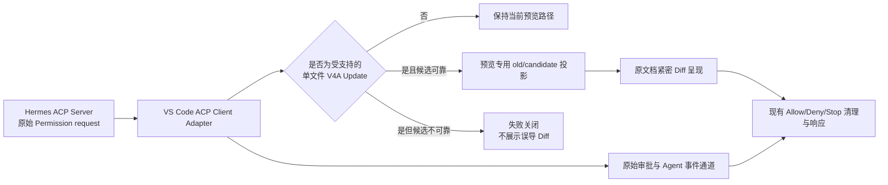

# 目标状态（To-Be）

- Status: confirmed
- Prerequisites: [03-as-is.md](./03-as-is.md)
- Evidence: 已确认的 D-01 至 D-10、AC-01 至 AC-14；真实 Permission payload 探针；V4A 候选正文与多范围回滚确定性探针
- Confirmed decisions: D-01 至 D-10
- Confirmation evidence: 用户于 2026-08-17 明确回复“实施”
- Confirmation date: 2026-08-17
- Blocking open questions: 无

## 目标方案概览

本次采用“插件内、预览专用、失败关闭”的兼容方案，并将两个子问题保持为独立能力：

1. **V4A 预览兼容**：ACP Client Adapter 保留原始 Permission request，只为原文档 Diff 预览建立不可反向修改原请求的候选投影。
2. **紧密 Diff 呈现**：原文档 Editor 根据行级 hunk 生成旧行与新行交错的临时预览，不再插入完整新文段。
3. **安全清理**：每个临时插入段分别记录最终范围和校验信息，退出时按文档位置逆序移除；任何不确定性都不得盲目覆盖用户内容。
4. **交互隔离**：Permission、Pending、队列、Allow/Deny、反馈、Stop、Agent Working 和最终回答继续使用现有数据与时序。

该方案对应 G-01 至 G-09，并直接解决 As-Is 中的错误 `newText`、整体插入布局和单连续块回滚限制。

## 方案选择

### 方案 A：插件内预览兼容（采用）

- 优点：两项修复都能进入 `0.2.52.vsix`；不要求修改或重新分发 Hermes Python；修改范围可限制在原文档 Diff 预览。
- 风险：插件生成的 V4A 候选必须与 Hermes 实际 Patch 语义保持一致。
- 控制：严格识别支持范围、逐字节一致性回归、歧义失败关闭、真实 `hermes acp` 集成验证。

### 方案 B：修改 Hermes Python ACP Server Adapter（不采用）

- 优点：从生产端纠正 ACP `newText` 语义，其他 ACP 客户端也可受益。
- 不采用原因：修复不会进入 VSIX，无法满足 `0.2.52` 单包交付；还会影响独立 Hermes 运行时和其他客户端，超出当前范围。

### 方案 C：插件通用改写所有 Patch 和 Diff（不采用）

- 优点：理论上可覆盖更多 Patch 类型。
- 不采用原因：会扩大到 Add/Delete/Move、多文件和正常全文候选，显著提高误判及回归风险，不符合“只改当前问题”。

## 概念边界

### 不变边界

- Hermes Python checkout、Hermes Core、Desktop、CLI、Gateway 和其他 ACP 客户端不修改。
- 原始 Permission request、request ID、session ID、tool call ID、`rawInput`、options 和原始 Diff block 保持不变。
- Agent 的 session/update、Thinking、Action、工具结果、Working、最终回答和消息持久化不读取预览投影。
- 确认区域的控件、选项、反馈输入、提醒、Pending、队列、Stop 和重新打开入口不重新设计。
- 新文件预览、未打开文件的 Review、完整 Review 阈值、颜色和装饰语义保持现状。

## V4A 预览兼容规则

### 进入条件

只有同时满足以下条件，才把 Permission 识别为受支持的 V4A 预览兼容对象：

- 工具语义明确为 `patch`，且 `arguments.mode` 为 `patch`。
- `rawInput.arguments.patch` 是完整的 V4A Patch body。
- tool call 只有一个 Diff block。
- Patch 只有一个文件操作，且操作类型为 `Update File`。
- Patch 目标路径与 Diff block 的 `path` 解析到同一个目标文档。
- Diff block 的 `oldText` 是候选计算的原始正文。
- Diff block 的 `newText` 与原始 V4A Patch body 相同，能够证明当前是已知错误投影，而不是正常的候选正文。

任一条件不满足时，不得猜测。正常 replace、`write_file`、标准全文候选和其他非目标 Permission 按原路径处理；Add/Delete/Move 和多文件 V4A 保持本次非目标行为。

### 候选正文规则

- 候选只在内存中生成，不写文件、不保存文档、不提前执行 Hermes Patch。
- 一个或多个 hunk 按 Patch 顺序作用于同一份内存正文。
- 每个 hunk 的上下文、删除内容和作用位置必须唯一成立；重复上下文无法唯一定位、上下文不匹配、hunk 重叠冲突、目标路径不一致或 Patch 结构不完整均视为失败。
- 支持范围内的纯新增行、纯删除行、替换行、中文正文、中文路径、文件首尾、无末尾换行和常见换行格式必须保留原始文本语义。
- 候选生成不得把 `*** Begin Patch`、`*** Update File`、`@@`、`*** End Patch` 或其他控制行写入候选正文。
- 预览投影只包含目标路径、原始正文和候选正文；不得替换原始 request 或成为 Agent 工具输入。

### 一致性规则

- 对所有支持的回归样例，插件候选正文必须与 Hermes `0.18.2` 对相同原文和 Patch 的实际执行结果逐字节一致。
- 一致性验证至少覆盖单 hunk、多 hunk、中文、文件首尾、无末尾换行、增删数量不等和多个相隔修改。
- 任何支持样例出现不一致，均阻断 `0.2.52` 打包交付；不得通过放宽匹配或展示近似 Diff 绕过。

## 紧密 Diff 呈现规则

### hunk 形成

- 基于原始正文与候选正文的行级 Diff operations 划分 hunk。
- 连续删除和新增属于同一个替换 hunk；中间出现未变化行时结束当前 hunk。
- 未变化行保留一次，作为不同 hunk 之间的定位上下文。
- “行”以真实换行符分隔；Editor 的视觉自动换行不参与 hunk 或配对。

### 行配对与显示

| hunk 内容 | 目标显示 |
| --- | --- |
| 删除数 = 新增数 | 旧 1、新 1、旧 2、新 2，依次交错 |
| 删除数 > 新增数 | 先逐行配对，剩余旧行继续红色显示 |
| 新增数 > 删除数 | 先逐行配对，剩余新行紧接绿色显示 |
| 纯新增 | 只插入并显示绿色新行 |
| 纯删除 | 原位置只显示红色旧行 |
| 多个相隔 hunk | 分别紧密显示，中间上下文只出现一次 |

- 旧行保持在原文档原位置并使用当前删除装饰。
- 新行只作为临时内容插入到对应旧行或 hunk 锚点之后，并使用当前新增装饰。
- 单行替换仍表现为“旧行后紧接新行”，与当前小范围结果保持可观察一致。
- 不改变颜色、字体、Editor 布局、Review 入口或确认区域中的 Diff 摘要规则。

## 临时预览与回滚规则

### 应用

- 预览开始前记录源文档文本、版本、dirty 状态和每个 hunk 的稳定定位信息。
- 多个临时插入段必须以不会因前序插入而破坏后序定位的顺序应用。
- 应用完成后，以最终文档坐标记录每个临时插入段的范围、文本及前后校验信息；不得只保留应用前偏移。
- 预览只改变打开文档的未保存内存状态，不主动保存到磁盘。

### 清理

- Allow、Deny、Stop、确认关闭、Permission 过期、Session 释放、扩展释放和重新打开预览都必须进入同一安全清理语义。
- 多个临时范围按文档位置从后向前清理，避免前方文本长度变化使后方范围失效。
- 每个范围只有在文本和定位校验仍成立时才可删除。
- 若用户编辑导致任一临时范围无法唯一确认，系统不得盲目回滚或覆盖用户内容；该次审批不得继续按旧预览无提示执行。
- 清理成功后，文档必须恢复为预览前文本和合理的 dirty 状态；Allow 随后才使用原始 Permission allow 结果让 Hermes 执行真实 Patch，避免内容重复。

## Permission 与 Agent 隔离

### 正常路径

- Permission 入队、展示、提醒、重新打开预览、Allow、Deny、自由反馈、session grant 和请求完成时序保持当前基线。
- 预览投影不得改变 request ID、tool call ID、Permission options、作用域、问题文案来源或响应 payload。
- 原文档中如何排列红绿行，不得生成新的 Agent 消息或改变现有 Action 的详情。

### 失败路径

- 已明确属于受支持的单文件 V4A Update，但候选生成失败时，不展示原文对 Patch 指令的错误 Diff。
- 通过现有 Permission 拒绝/工具失败语义阻止工具执行，文件保持不变；不自动 Allow，不把 Patch 控制文本降级为候选。
- 非目标 payload 不因本兼容逻辑被自动拒绝或改写，继续使用当前行为。
- 失败处理不得绕过既有取消屏障、Permission 队列所有权或 turn 生命周期。

## 回归测试总原则

- 测试必须证明“修复了目标行为”和“目标边界之外没有变化”，不能只证明新增函数能运行。
- 单元测试、契约重放、真实 ACP 集成、打包后 UI 验证和 VSIX 完整性是五个独立门禁；低层通过不能替代高层验证。
- 回归比较使用同一输入的修改前基线与修改后结果；除原文档 Diff 候选和行排列外，Permission、Agent 事件与 Webview 状态必须无差异。
- 任一必测项失败，都不得标记完成或生成最终交付结论；范围外的既有生命周期问题若被发现，记录为阻塞或独立问题，不在本次静默修改。

## 缺口到测试的完整映射

| 既有缺口或历史漏点 | 必测场景 | 通过证据 | 映射 |
| --- | --- | --- | --- |
| V4A `newText` 是 Patch 指令 | 真实 payload 生成正文候选 | 控制文本为零，只标实际变化 | AC-01、AC-02 |
| 只验证单 hunk | 单文件 1、2、3 个 hunk，顺序相邻与相隔 | 最终候选与 Hermes 逐字节一致 | AC-03、AC-06 |
| 没覆盖中文和文本边界 | 中文路径/正文、CRLF/LF、文件首尾、无末尾换行 | 内容和换行无损 | AC-01、AC-06 |
| 重复上下文可能误定位 | 唯一上下文、重复上下文、缺失上下文、重叠 hunk | 唯一者成功，其余失败关闭 | AC-08A |
| 可能误伤正常 Diff | replace、`write_file`、标准全文候选、局部 old/new | request 与预览保持基线 | AC-07 |
| 可能误识别非目标 V4A | Add/Delete/Move、多文件、路径不一致、多个 Diff block | 不进入兼容转换 | AC-08 |
| 原始 Permission 可能被改写 | 转换前后深度比较 request、Diff block、`rawInput`、IDs、options | 原始对象语义不变 | AC-01、AC-11 |
| 旧块 + 新块相距过远 | 2、3、10 行等量替换 | 逐行红绿交错 | AC-09 |
| 增删数量不一致漏测 | 3 删 1 增、1 删 3 增 | 配对后剩余行相邻 | AC-09 |
| 纯新增/纯删除漏测 | hunk 只有新增或只有删除 | 仅出现对应颜色 | AC-09 |
| 多 hunk 上下文重复 | 两个相隔修改含长中间段落 | 上下文只出现一次 | AC-09 |
| 视觉换行可能被误当行 | 长行触发 Editor 自动换行 | 仍按一个逻辑行处理 | AC-09 |
| 单一插入块回滚覆盖不足 | 同一文档 2、3、10 个临时插入范围 | 所有退出路径逐字节恢复 | AC-10 |
| 原始偏移受累计位移影响 | 前后 hunk 长度差异显著 | 逆序清理后无残留、无误删 | AC-10 |
| 用户编辑期间可能盲目回滚 | 编辑预览范围内、范围外、锚点附近 | 不覆盖用户内容；不继续旧审批 | AC-10 |
| Allow 后可能重复写入 | 预览清理后允许 Hermes 执行 | 最终正文只应用一次 | AC-06、AC-10 |
| 审批 UI 可能被连带修改 | Allow、Deny、预设选项、反馈、提醒、重新打开 | 前后状态与事件快照一致 | AC-11 |
| Pending/队列/Stop 可能回归 | Pending 时 Stop、队列中有下一请求、Permission 过期 | 所有权和取消顺序保持基线 | AC-10、AC-11 |
| Deny 屏障和兄弟 Permission 曾漏测 | Deny 时存在同 turn 兄弟请求和待发送 prompt | 先建立取消屏障；兄弟请求取消；旧 turn 释放前不启动下一 prompt | AC-11、AC-12 |
| `/deny` 控制文本可能泄漏 | 拒绝路径完整事件重放 | `/deny` 不成为用户或 Agent 可见消息 | AC-12 |
| 完成 Action 曾被重新终态化 | 已完成 Read/Edit 后出现 Permission 和 turn 完成 | 已完成 Action 状态不被重写 | AC-12 |
| 拒绝后旧 turn 事件可能泄漏 | Deny 后到达迟到 tool update/assistant text | 不污染新 turn、Working 或答案 | AC-12 |
| 同名工具可能被错误合并 | 两个同名工具使用不同 `toolCallId` 交错更新 | Action 各自归属和终态正确 | AC-12 |
| Working/最终回答分流可能回归 | 含 `pendingText`、Thinking、Action、普通回答的完整序列 | Working 与最终回答不串流、不重复 | AC-12 |
| Agent 回显隔离未显式证明 | 同一完整 ACP 事件 fixture 前后重放 | Thinking/Action/结果/Working/答案快照一致 | AC-12 |
| 新文件和完整 Review 可能误伤 | 新文件、未打开文件、达到完整 Review 的修改 | 保持当前预览类型与行为 | AC-07、GR-06 |
| 包可能未含最新修复 | 源码与 VSIX 包内对应内容身份比较 | 两项修复均存在且版本为 0.2.52 | AC-13、AC-14 |
| 旧包可能被覆盖 | 打包前后检查 `0.2.51` | 文件仍存在且身份不变 | AC-13 |

## 分层验证门禁

### Gate 1：纯逻辑与文本契约

- V4A payload 识别正例和全部负例。
- 候选生成、hunk 顺序、歧义失败和 Hermes 结果一致性样例。
- 行级 hunk、配对、剩余行、纯增删、上下文唯一展示。
- 多范围记录、逆序清理和用户编辑冲突检测。

### Gate 2：扩展状态与交互契约

- 原始 Permission request 深度不变。
- Allow/Deny/反馈/Pending/队列/提醒/重新打开/过期/Stop 的事件和状态快照不变。
- Thinking、Action、工具结果、Working、最终回答和 late event 隔离不变。
- 已完成 Action 不被重新标记为失败或运行中。
- Deny 先建立取消屏障，取消同 turn 兄弟 Permission，不泄漏 `/deny`，且旧 turn 释放前不排空下一 prompt。
- 不同 `toolCallId` 的同名工具保持独立；`pendingText` 仍按既有事件顺序进入 Working 或最终回答且不重复。

### Gate 3：真实 ACP 集成

- 使用真实 `hermes acp` 捕获单文件 V4A Permission payload。
- 插件端生成候选并展示；Deny 后文件不变，Allow 后最终文件等于候选。
- 单 hunk、多 hunk、中文正文各至少一个真实集成样例。
- 非 V4A Permission 走原路径。

### Gate 4：打包后 VS Code UI

- 安装新打包的 `0.2.52` VSIX，而不是直接运行工作区源码。
- 复现用户截图对应的全文 V4A 场景，确认原文不再整篇红、Patch 指令不再整段绿。
- 复现中长段落等量和不等量替换，确认逐行紧密排列。
- 操作 Allow、Deny、Stop、反馈和重新打开预览，确认交互及 Agent 回显无变化。
- 验证小范围单行 Diff、新文件和完整 Review 未退化。

### Gate 5：VSIX 产物

- `package.json`、锁文件和包内 `extension/package.json` 均为 `0.2.52`。
- 新产物名为 `hermes-agent-vscode-0.2.52.vsix`，已有 `0.2.51` 不被覆盖或删除。
- 包内源代码、README 和资源与打包工作区一致；README 不发生非本任务改写。
- archive 完整性检查通过，报告 SHA-256 和稳定绝对路径。
- 本次只生成本地 VSIX，不发布 Marketplace。

## 交付和回退

- 交付单位只有 `0.2.52` VSIX，不要求用户修改 Hermes Python。
- 若 V4A 候选一致性、回滚安全、审批隔离或 Agent 回显任一门禁失败，不交付该包。
- `0.2.51` 保留为可恢复的既有产物；回退方式是重新安装该旧包，而不是删除或覆盖用户文件。
- 本次不引入配置开关、迁移脚本或协议版本变更。

## 验收映射

| 目标变化 | 主要验收 |
| --- | --- |
| 插件内 V4A 预览候选 | AC-01 至 AC-08A |
| 逐行紧密 Diff | AC-09 |
| 多范围安全清理 | AC-10 |
| 审批与 Agent 隔离 | AC-11、AC-12 |
| `0.2.52` 单包交付 | AC-13、AC-14 |

## 完成定义

只有以下条件全部满足，才可以认为本 Spec 对应问题已真正解决：

- 用户可见的两类错误呈现均在打包后的 VSIX 中消失。
- 插件候选与 Hermes 实际执行结果在支持范围内逐字节一致。
- 所有临时预览退出路径都可安全清理，且不覆盖用户编辑。
- 目标范围之外的 Diff、审批交互、Agent 回显和生命周期回归比较无差异。
- 五层验证门禁全部通过，并提供可复查证据。
- `hermes-agent-vscode-0.2.52.vsix` 完整、可安装、版本正确，且 `0.2.51` 保持不变。
