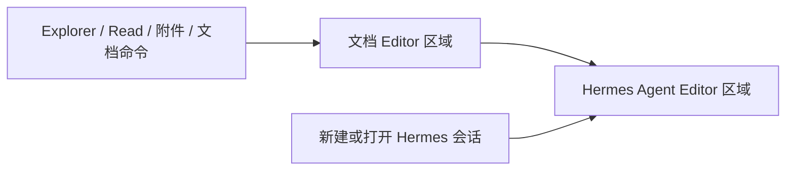
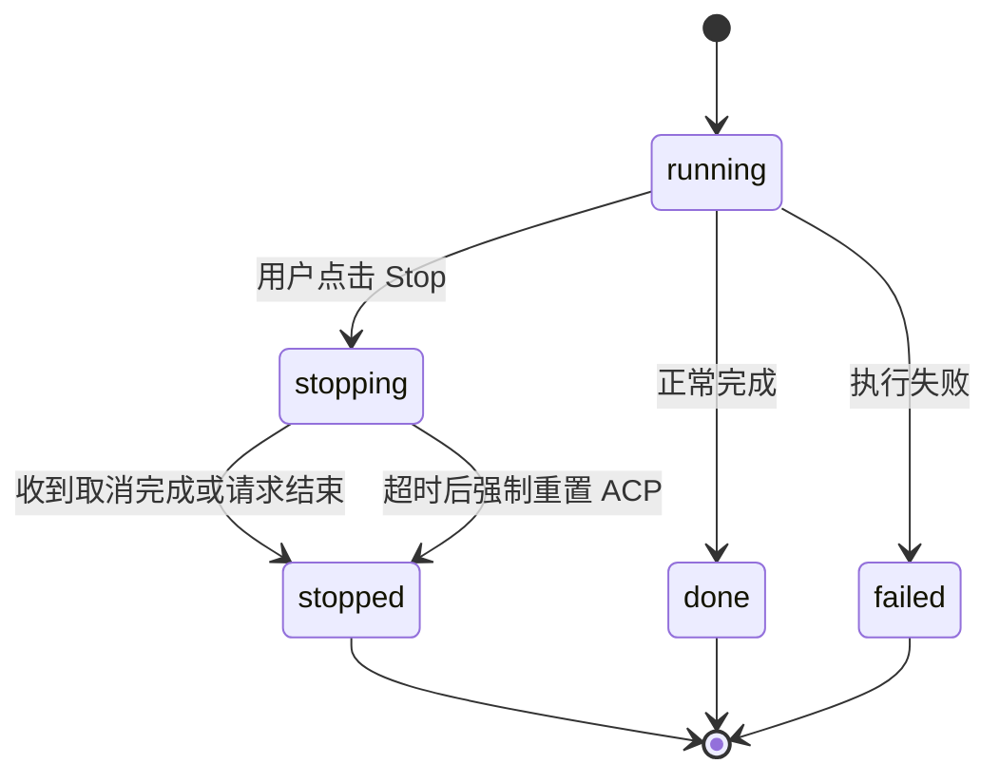

# 目标状态

- Status: confirmed
- Prerequisites: [03-as-is.md](./03-as-is.md)
- Evidence: 用户确认的目标行为；AC-01 至 AC-10
- Confirmed decisions: D-01 至 D-05
- Blocking open questions: 无

## 总体方案

采用局部修复方案：保留现有 Webview、会话和 ACP 主流程，在交互状态、Editor 路由、Diff 预览和取消闭环上补足明确规则。相比整体重构，该方案修改面更小；相比继续追加单点样式，它能覆盖复测发现的状态和生命周期问题。

## 目标行为

### TB-01 Skill 输入状态

Skill 被选中时，其标识已经构成输入区内容，placeholder 必须隐藏。Skill 被移除且正文为空时才恢复 placeholder。此变化映射 G-01、AC-01。

### TB-02 标题编辑状态

标题具有展示态和编辑态。展示态点击负责进入编辑并计算初始光标；编辑态完全使用输入框原生光标行为，不再因点击重新创建输入框。保存与取消规则保持不变。此变化映射 G-01、AC-02。

### TB-03 Editor 分区路由

系统分别识别文档目标区域和 Hermes Agent 目标区域：

- 打开 Hermes Agent：复用现有 Agent 区域；没有时，在文档区域右侧创建。
- 打开文档：复用现有文档区域；没有时，在 Agent 区域左侧创建。
- 发现类型错误的 Tab：先在正确区域恢复，再移除错误区域中的同一 Tab。
- 只管理 Hermes 自有 Webview，不改变其他扩展 Webview 的归属。

该方案映射 G-02、AC-03、GR-02、GR-03。

### TB-04 Diff 临时预览

匹配旧文段后，系统在其段落结束位置下方临时插入完整新文段。旧文实际变化字符显示红色，新文预览块显示绿色。预览状态保存原文依据、插入范围和文档版本。

- `Accept`：校验文档未发生冲突，移除临时预览，再允许 Hermes 执行正式修改。
- `Deny`：移除临时预览，再拒绝权限。
- Stop、关闭确认、切换待确认项或扩展释放：按 Deny 的清理规则回滚。
- 文档版本发生非预期变化：停止确认，保留用户内容并提示重新生成 Diff，不进行整文件覆盖。

选择该方案是因为用户已确认允许确认前临时写入当前文档。继续使用 decoration 附加文本无法可靠展示完整多行块；另开只读预览又不满足“位于原文段落下方”。此变化映射 G-03、AC-04、GR-04。

### TB-05 Read 文档入口

Read action 的可见名称只取文件名，完整路径作为 tooltip 和打开依据。点击后使用 VS Code 通用文档打开能力，并通过 TB-03 路由到文档区域。文件类型由 VS Code 已安装的编辑器贡献决定，不限于文本文件。此变化映射 G-02、AC-05。

### TB-06 Stop 生命周期

每个运行轮次具有明确状态：

- 进入 `stopping` 后，当前轮次的后续流事件失效，新问题暂不提交。
- 正常路径先发送 ACP cancel，并等待取消完成或当前请求结束。
- 超时路径终止并重建 ACP 传输，确保后端旧任务不再运行。
- 用户取消属于正常终止，不进入 ACP 失败后的 CLI fallback。
- 只有进入 `stopped` 后才恢复新问题发送。

该方案以协议取消为主、进程重置为兜底；仅做前端忽略不能解决后端排队，仅在每次 Stop 时直接杀进程又会造成不必要的会话传输重建。此变化映射 G-04、AC-06、GR-05。

### TB-07 响应式会话

会话页面以当前 Webview 宽度为唯一宽度约束。正文、路径、表格、代码、Thinking 和输入区都必须在容器内收缩或换行；窄宽度下减少留白、压缩非必要文字控件，并避免附件形成页面级横向列表。不得通过简单裁切隐藏超宽内容。此变化映射 G-05、AC-07。

### TB-08 新轮次滚动

发送新问题时创建一次性“定位最新轮次”意图。新 Assistant 消息出现后，视区定位到该消息的最新输出锚点；流式生成继续保持最新行可见。用户查看历史可以影响当前轮次后续跟随，但下一次发送必须重新定位。此变化映射 G-01、AC-08。

### TB-09 Thinking 运行态视口

Thinking 限高由消息运行状态控制：

| 状态 | 展开后的高度 | 内部滚动 | 最新行定位 | 顶部渐隐 |
| --- | --- | --- | --- | --- |
| `running` | 约 10 行 | 有 | 自动定位到底部 | 上方有溢出时显示 |
| `done` | 完整铺开 | 无 | 不强制 | 无 |
| `stopped` | 完整铺开 | 无 | 不强制 | 无 |
| `failed` | 完整铺开 | 无 | 不强制 | 无 |

状态切换不得覆盖用户手动折叠选择。此变化映射 G-01、AC-09。

### TB-10 确认动作

确认区域动作顺序固定为左侧 `Deny`、右侧 `Accept`。`Accept` 使用主按钮层级，`Deny` 使用次按钮或拒绝层级；底层权限结果语义不变。此变化映射 G-03、AC-10。

## 错误与异常处理

- Editor 目标区域在操作中被关闭：重新计算区域，不使用失效引用。
- 文档 URI 无法解析或默认编辑器打开失败：显示明确错误，不在 Agent 区域回退打开。
- Diff 目标旧文段无法唯一定位：不插入临时预览，要求重新生成或重新定位。
- Diff 清理失败：不得继续发送 `Accept`，避免正式修改和预览重复。
- ACP cancel 超时：执行传输重置，并将该轮标记为 `stopped`，不得转 CLI。

## 迁移与兼容

- 不迁移已有会话数据。
- 扩展升级后首次打开或 Tab 变化时，按新路由规则纠正 Hermes 与文档 Tab。
- 已安装的 VS Code 文件编辑器继续负责对应文档类型。
- 现有 Skill、Mode、附件和权限协议保持兼容。

## 验证意图

实施后必须按 [02-acceptance-criteria.md](./02-acceptance-criteria.md) 逐项验证，并重点覆盖：取消迟到事件、取消超时、Diff 预览期间用户编辑、Agent 区域关闭后重建、最小宽度下长路径与表格、Thinking 从 `running` 转为结束状态。
