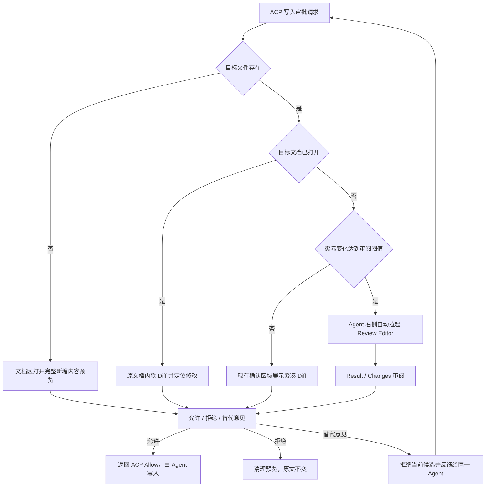
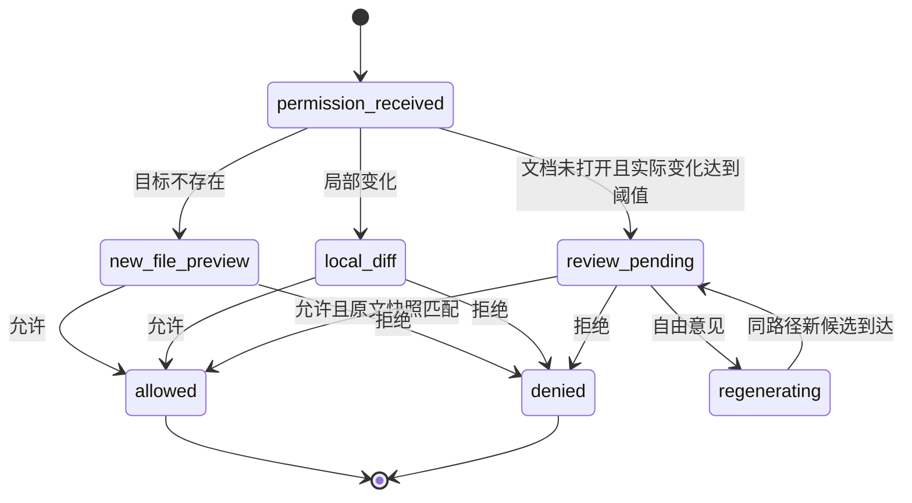

# 目标状态

- Status: confirmed
- Prerequisites: [03-as-is.md](./03-as-is.md)
- Evidence: 用户确认的流程、D-01 至 D-19、AC-01 至 AC-23
- Confirmed decisions: D-01 至 D-19
- Blocking open questions: 无

## 总体体验

插件在收到实际 ACP 写入审批请求后，根据目标文件状态和候选变化量选择审阅路径：



## TB-01 插件侧审阅分类

插件不判断 Agent 的真实任务意图，也不创建 Plan 审批协议。分类只发生在现有 ACP Permission 已携带可审阅的文件修改后：

- 目标文件不存在：`new-file`。
- 文档已打开：无论变化大小，`inline-diff`。
- 文档未打开且实际变化达到 `18` 行或 `1600` 字符任一阈值：`full-review`。
- 其他情况：`local-diff`。

阈值只决定 UI。允许、拒绝和写入仍走原 ACP 请求，不改变 Agent 的自动模式、规划方式或修改内容。

## TB-02 新增文件预览

- 新增文件不渲染红绿 Diff。
- 在文档 Editor 区打开只读虚拟文档，使用目标文件名并完整展示候选内容。
- 确认前不在文件系统创建目标文件。
- 允许后仅向 ACP 返回 Allow；Agent 创建真实文件后，关闭虚拟文档并打开真实文件。
- 拒绝、替代意见、会话终止或请求失效时关闭虚拟文档，目标文件保持不存在。

## TB-03 局部修改流程

### 文档已经打开

- 直接在原文档中临时插入候选内容，展示 Diff 并将视区定位到第一处变化。
- 仅实际变化行高亮。
- Agent 会话使用现有确认区域显示操作选项和可选自由输入，不重复展示同一份 Diff。
- 解决 Permission 前先移除临时插入内容；检测到 Auto Save 已保存预览时恢复审批前原文。

### 文档未打开

- 不额外创建完整 Review Editor。
- 在现有确认区域中展示紧凑 Diff，范围只覆盖当前待确认修改和必要上下文。
- 确认区域继续遵循现有最大高度和内部滚动规范。

### 自由意见

- 用户输入替代意见后，当前 Diff 立即失效并安全清理。
- 原文保持不变。
- Working 记录问题和用户意见。
- Agent 重新生成 Diff，完成后重新进入 Pending。

## TB-04 自动 Review 工作区

命中 `full-review` 时，布局变为：

```text
文档 Editor（如有） | Hermes Agent Editor | 临时 Review Editor
```

- Review Editor 位于 Hermes Agent 右侧，是独立 Editor 区域。
- 系统主动将焦点切到 Review，不要求用户从 Response 中寻找入口。
- Review 顶部状态显示：`候选修改已完成 · 尚未应用到原文`。
- 默认页签为 `Result`。
- `Changes` 与 Result 并列，可直接切换。

### Result

- 展示完整候选文档。
- 保持文档原生阅读体验和完整内容，不只展示改变片段。
- 允许用户滚动、选择和复制。

### Changes

- 使用单栏 Unified Diff。
- 以完整文档最终顺序呈现。
- 删除行整行红色，新增行整行绿色，无删除线。
- 未修改上下文使用普通样式。
- 可提供上一处/下一处变化和变化数量定位，但不得替代完整文档滚动。

## TB-05 审阅决定与反馈循环

- 确认区域继续展示 ACP 原始选项，不伪造“应用到原文”等协议外 optionId。
- 允许：审批时原文快照仍匹配后，返回 ACP Allow，由 Agent 执行原写入。
- 拒绝：返回 ACP Deny，关闭预览或 Review，原文不变。
- 自由意见：先拒绝当前候选，再直接续入当前 ACP 轮次；不进入 Queue，不创建可见 Steer 消息或新 Assistant continuation。
- 同一会话、同一路径的下一版完整候选到达时复用原 Review Editor；等待期间显示“正在生成修订候选”。
- 用户手动关闭 Review 后请求仍 Pending；确认区域提供“重新打开完整审阅”。

## TB-06 冲突与清理

- 审批时保存原文快照；允许前再次读取目标文件。
- 目标文件已变化时禁止返回 Allow，保留当前请求并提示重新生成。
- Permission 失效、会话关闭或传输断开时清理虚拟文档、装饰和 Review Editor。
- 新增文件允许后，只有真实文件内容与已批准候选一致时才切换到真实文件 Tab。

## TB-07 插件能力边界

- 插件不要求 Agent 先生成 Plan，不拦截 Agent 的自动模式执行阶段。
- 插件不能保证 Agent 将整篇改写合并为一次 Permission；若上游只发送多个局部写入，仍逐个按局部 Diff 审阅。
- 完整 Review 是已有写入候选的审阅工作区，不是对 Agent 工作流的重写。

## TB-08 通用确认组件

### 框架复用

- 继续使用当前确认区域的外层容器、定位、层级和最大高度。
- 保留当前问题标题、选项列表的视觉体系。
- 在选项列表最后增加自由输入行，不额外包裹第二张卡片。
- 不添加底部“继续”操作行。

### 通用结构

```text
确认问题

A  预设选项一
B  预设选项二
C  [输入其他意见……]
```

字母只是快捷和层级提示，不改变已有按钮的整体 UI 规范；最终视觉应以现有 Hermes 确认样式为准。

### 交互

- 点击预设选项立即提交。
- 输入行按 Enter 立即提交。
- Shift+Enter 换行。
- 预设选择和输入互斥。
- 提交后立刻锁定，直到收到成功、失败或失效结果。
- 失败时恢复当前请求及用户输入，允许重试。
- 请求结束或会话终止时清理输入草稿。

### 语义适配

自由意见由场景处理器解释：

- Edit：取消当前 Diff 并重新生成。
- Execute：拒绝当前动作并重新规划。
- Review：保留原文，更新候选稿。
- Clarify：作为用户答案。

Permission 的预设选项仍按现有 ACP `optionId` 返回。自由意见走独立反馈路径，不能构造不存在的 ACP Permission 文本 outcome。

## TB-09 Working 动作链接

### 本地文件

- Read/Edit/Write 等动作后仅展示文件名。
- 完整路径放入 tooltip 和打开数据。
- 默认文字颜色与该动作行普通正文一致。
- hover 时完整文件名显示连续下划线。
- 点击后使用既有文档区域路由打开。

### 外部网址

- URL 先按完整 `http://` 或 `https://` 地址识别，再处理本地路径。
- 一个 URL 只生成一个可点击元素。
- 默认普通文字颜色，hover 连续下划线。
- 点击调用 VS Code 外部打开能力。

## TB-10 Working 代码执行动作

### 标题行

代码执行类 Action 继续沿用现有 Working 时间线行和展开箭头，不新增卡片。标题组织为：

```text
Run Python  解析配置并生成候选文档
```

- `Run Python`、`Run Shell` 等动作类型保持简短、可扫描。
- 后半段使用自然语言说明“为什么执行”，不展示“怎么实现”。
- 不在标题中放置完整脚本、命令、参数串、标准输出或错误堆栈。
- 如果上游没有可靠目的描述，只显示动作类型；不得从代码内容主观生成错误摘要。

### 展开详情

- 原始脚本或命令放在现有 `.step-content` 展开区中。
- 同时存在明确输入和输出，且区分两者有助于理解时，使用 `IN/OUT`。
- 只有脚本或命令时，显示一个代码块，不显示空 `OUT`。
- 只有有价值的结果时，显示一个结果块，不显示空 `IN`。
- 无脚本、无结果且无 Diff 时，不显示展开箭头。
- 失败时错误信息留在展开详情中，标题只保留自然语言目的和既有失败状态。
- 沿用现有代码字体、换行、最大高度、滚动和主题变量，不新增独立详情框架。

## TB-11 Working 问答记录

任务运行中发生 Clarify、Edit feedback 或 Review feedback 时，Working 时间线记录：

```text
Clarification / Edit feedback / Review feedback

Agent  问题
You    最终选择或输入内容
```

- 只记录最终提交内容，不记录未提交草稿。
- 回答后继续执行，记录仍停留在原发生位置。
- 选项回答和自由回答使用同一展示结构。
- 会话恢复时按原顺序还原。

## TB-12 状态模型



## TB-13 异常与恢复

- 原文在审阅期间被外部修改：禁止覆盖，保持 Review Pending，提示重新生成或比较冲突。
- 临时 Editor 创建失败：Permission 保持 Pending并显示明确错误，允许用户重试打开。
- 修订候选生成失败：原文不变，Review Editor 显示等待或失败状态，可继续反馈或拒绝。
- 自由意见提交失败：恢复输入内容，不产生重复 Working 记录。
- Permission 请求已失效：关闭确认 UI、清理 Diff，不发送迟到选择或文字。
- 手动关闭临时 Editor：保持 Pending；现有确认区域提供重新打开入口，不循环强制拉起。

## TB-14 UI 与回归保护

- Confirmation 新内容必须继承现有主题变量，不硬编码独立配色。
- 现有 `.permission-panel` 的位置、外框、滚动边界和相邻布局保持不变。
- 输入行高度从一行开始，按内容增长并设合理最大高度。
- 窄宽下文本换行，不能撑宽会话区域。
- 新 Editor 工作区遵循 VS Code Editor 最小宽度和现有文档/Agent 分区规则。
- 所有 AC-23 已修功能必须加入回归验证。

## TB-15 Run Settings Model

### 布局

```text
Run settings

Mode
[现有 Manual / Auto 选择，保持不变]

Model
[ 当前模型                         ▾ ]
```

- 移除 Popover 标题栏中的 Reset 按钮。
- `Model` 标题和下拉框上下排列；下拉框独占一行。
- 不把 Model 改成与标题左右对齐的紧凑行。
- 使用原 Popover 容器和现有主题变量，不扩大为新面板。

### 数据优先级

1. 当前 ACP 会话 `session/new` 或恢复响应中的 `models`。
2. ACP 尚未建立时，Hermes 当前 provider 的本地配置模型。
3. 当前默认模型作为最后兜底；不使用插件硬编码名单补齐。

### 状态与持久化

- 当前会话保存 `settings.model`。
- 成功切换后保存 `hermesAgent.lastModel`。
- 新会话初始化为 `lastModel`；没有历史值时使用 Hermes 当前默认模型。
- ACP 会话创建后校验继承值并调用 `session/set_model`。
- 切换失败恢复旧值，不污染会话或全局持久化。

## 迁移与兼容

- 不迁移已有会话数据。
- 旧会话中没有结构化问答记录时继续按原消息展示。
- ACP Permission 预设选项语义保持兼容。
- 不支持自由意见的请求只展示已有选项，不强行添加输入行。
- 临时新增文件预览和 Review 数据只属于当前 Permission，不直接写入原文。
